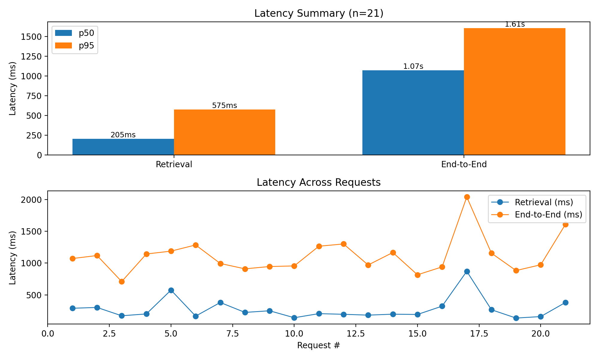

# Investment Insights Assistant (RAG)

A FastAPI-based investment research API that uses **retrieval-augmented generation (RAG)** to answer natural-language investment questions.  
The system ingests market data, news headlines, and SEC filings, retrieves relevant context using **FAISS vector search**, and generates grounded insights using an **OpenAI LLM**.

---

## 🔍 Features

- **Data Ingestion**
  - Historical stock prices via `yfinance`
  - Latest news headlines via `NewsAPI`
  - Recent SEC filings (10-K / 10-Q) via `sec-api`

- **Semantic Retrieval**
  - Embeddings generated using OpenAI `text-embedding-3-small`
  - FAISS index for top-k semantic search
  - Query-specific context assembly

- **LLM-Based Insight Generation**
  - GPT-3.5 for concise, grounded responses
  - Low-temperature prompting for consistency

- **FastAPI Service**
  - Single `/insights` POST endpoint
  - Served using Uvicorn

---

## 📊 Performance Metrics

Measured over **20+ API queries**:

- **p95 retrieval latency:** ~560 ms  
- **p95 end-to-end latency:** ~2.2 seconds  

Latency is tracked per request and aggregated across runs.

### Latency Comparison

The chart below shows **retrieval latency vs end-to-end latency** across sampled queries:



---

## 🚀 Reproducibility

### 1. Clone the repository
```bash
git clone https://github.com/harshit711/Investment-Insights-Chatbot-using-RAG.git
cd Investment-Insights-Chatbot-using-RAG
```

### 2. Create & activate a virtual environment
```bash
python -m venv venv
# Windows
venv\Scripts\activate
# macOS/Linux
source venv/bin/activate
```

### 3. Install Dependencies
```bash
pip install -r requirements.txt
```

### 4. Configure environment variables
```bash
OPENAI_API_KEY=your_openai_api_key
NEWSAPI_KEY=your_newsapi_key
SEC_API_KEY=your_sec_api_key
```

### 5. Run the API
```bash
uvicorn app:app --reload --host 0.0.0.0 --port 8000
```
The server will start on http://localhost:8000

## Usage
`/insights` **(POST)**

Submit an investment question and list of tickers, and receive a concise insight.

### Request
```bash
POST /insights
Content-Type: application/json

{
  "query": "How did AAPL perform today and what news influenced the move?",
  "tickers": ["AAPL","MSFT"]
}
```
### Response
```bash
{
  "insights": "Apple closed down 1.8% today after ..."
}
```

# Evaluation:
- Retrieval and end-to-end latencies logged per request
- Percentile metrics (p50, p95) computed over multiple runs
- Latency visualization generated using Matplotlib
- Results used directly in portfolio case study and resume

*Built with ❤️ for streamlined, data-driven investment decision support*
